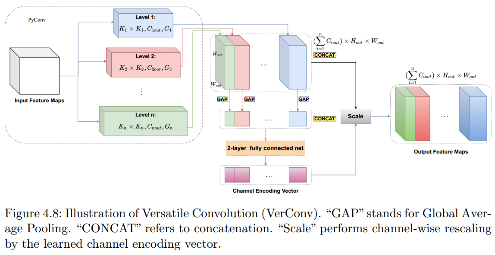
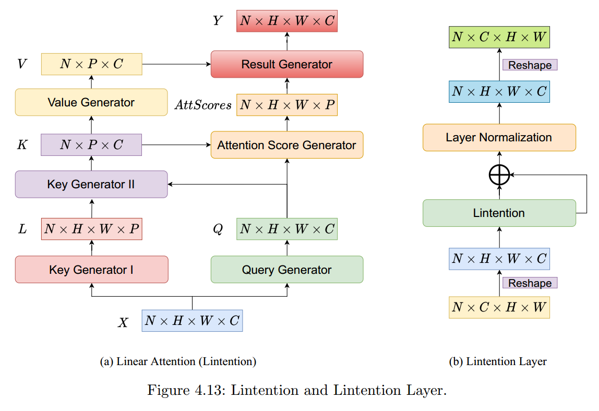

# Panoptic Lintention Network
This project hosts the code for implementing the models for Panoptic Segmentation proposed in the following paper:

> [**Panoptic Lintention Network: Towards Efficient Navigational Perception for the Visually Impaired**](https://arxiv.org/abs/2103.04128),
> @inproceedings{mao2021panoptic,
> title={Panoptic Lintention Network: Towards Efficient Navigational Perception for the Visually Impaired},
> author={Mao, Wei and Zhang, Jiaming and Yang, Kailun and Stiefelhagen, Rainer},
> booktitle={2021 IEEE International Conference on Real-time Computing and Robotics (RCAR)},
> year={2021},
> organization={IEEE}
> }

## VerConv and Lintention

## Installation
This implementation is based on [Detectron2](https://github.com/facebookresearch/detectron2). Please refer to [INSTALL.md](INSTALL.md) for installation and dataset preparation.

## Usage
Change to the directory [projects](projects/) for the implementations for VerConv, VerConvSep and Lintention which can be used as a stand-alone module.
